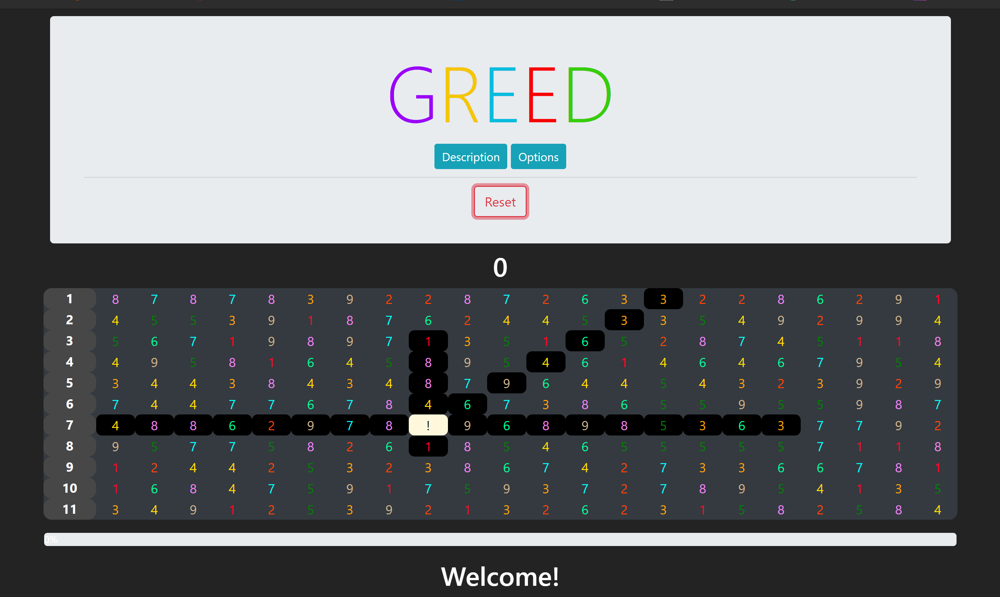

# GREED
Terminal game GREED recreated

[Try it!](https://garrettleising.github.io/GREED/index.html)

## Description

The object of Greed is to erase as much of the
screen as possible by moving around in a grid of
numbers. To move your cursor, simply use your
arrow keys or the the 'wedcxzaq' keys. Your
location is signified by the ! symbol.

w = Up | e = UpRight | d = Right | c =DownRight
| x = Down | z = DownLeft | a = Left | q =
UpLeft

When you move in a direction, you erase N number
of grid squares in that direction, N being the
first number in that direction. Your score
reflects the total number of squares eaten.

Greed will not let you make a move that would
have placed you off the grid or over a
previously eaten square. If no valid moves
exist, your game ends.
